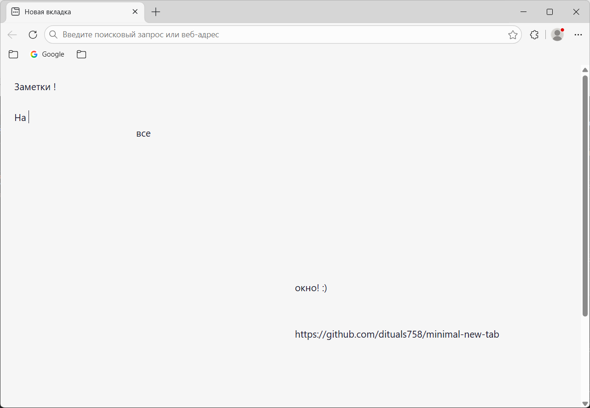
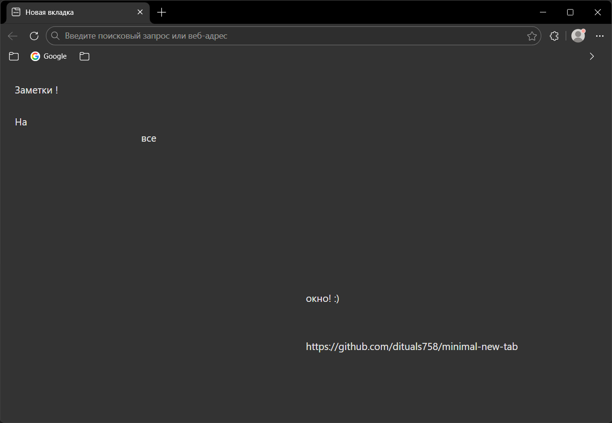

# Minimal New Tab

Минималистичная страница новой вкладки для Microsoft Edge и Chrome. Расширение убирает визуальный шум стандартной вкладки, оставляя только чистый фон и встроенный блокнот. Текст заметок автоматически сохраняется и восстанавливается при открытии новой вкладки. Цвет фона адаптируется к светлой или тёмной теме операционной системы.

## Возможности

- **Чистый фон** — никаких новостей, виджетов или обоев.
- **Встроенный блокнот** — пишите заметки прямо на новой вкладке.
- **Автосохранение** — текст сохраняется автоматически во время ввода, без необходимости нажимать кнопку.
- **Адаптация к теме** — автоматическое переключение между светлым (`#f6f6f6`) и тёмным (`#333333`) фоном.
- **Проверка орфографии** — включена по умолчанию (подчёркивание ошибок).
- **Лёгкость** — размер расширения — менее 2 КБ.
- **Конфиденциальность** — для работы требуется только разрешение `storage` (хранение заметок). Расширение не собирает и не передаёт данные.

## Скриншоты

| Светлая тема | Тёмная тема |
|--------------|-------------|
|  |  |

## Установка

### Из магазина надстроек Microsoft Edge
*Ссылка на страницу расширения будет добавлена после публикации.*

### Установка в режиме разработчика
1. Скачайте и распакуйте архив с файлами расширения.
2. Откройте браузер и перейдите на страницу `edge://extensions/`.
3. Включите **режим разработчика** (переключатель в левом нижнем углу).
4. Нажмите **Загрузить распакованное** и выберите папку с файлами расширения.

## Требования

- Microsoft Edge 146+ или Chrome 120+.
- Разрешение `storage` для сохранения заметок.

## Лицензия

MIT